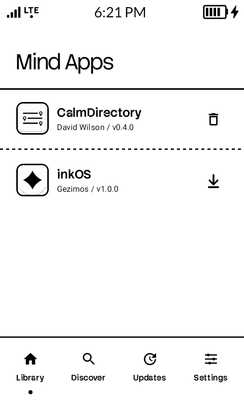
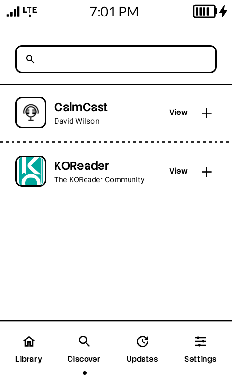
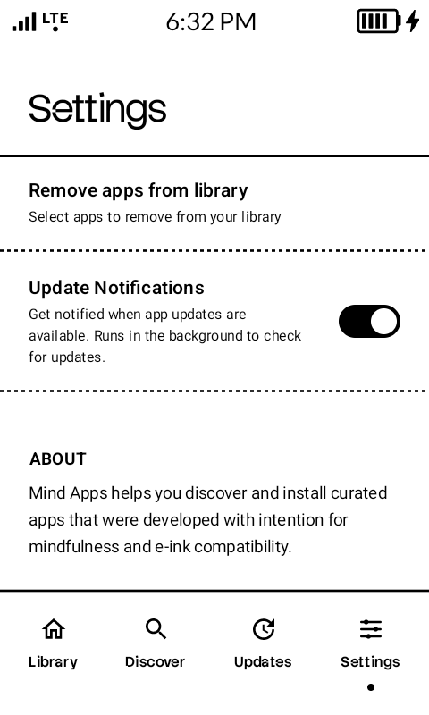

<p align="center">
  
</p>

<h1 align="center">Mind Apps</h1>

<p align="center">
  <strong>An open-source app store for e-ink mindful apps</strong>
</p>

<p align="center">
  <a href="https://mindapps.dev">mindapps.dev</a>
</p>

---

## About

Mind Apps is an open-source app store specifically designed for e-ink mindful apps. The goal is to create a central hub where you can find tools crafted for e-ink devices — apps that were developed with intention for mindfulness and e-ink compatibility.

## Screenshots

<p align="center">
  
  
  
</p>

## Featured Apps

At launch, Mind Apps includes:

- **CalmCast** — Podcast player for e-ink
- **CalmDirectory** — File manager for e-ink
- **inkOS** — Launcher for e-ink devices
- **KOReader** — Document reader
- **InkMessage** — E-ink fork of QUIK messages

## Coming Soon

- More **Calm** apps
- **Flights** — Scan and email boarding passes to convert them into mobile boarding passes, with flight tracking and more

## Features

- Curated apps optimized for e-ink displays
- Silent background updates
- Minimal, distraction-free interface
- App details with descriptions, tags, and release info
- Library management

## Installation

1. Download the latest APK from [Releases](https://github.com/your-repo/mindapps/releases)
2. Enable "Install from unknown sources" when prompted
3. Install and enjoy

## Building from Source

```bash
# Clone the repository
git clone https://github.com/your-repo/mindapps.git

# Navigate to project directory
cd mindapps

# Build debug APK
./gradlew assembleDebug
```

The APK will be located at `app/build/outputs/apk/debug/app-debug.apk`

## Contributing

Contributions are welcome! Feel free to submit issues and pull requests.

## License

This project is licensed under the GNU General Public License v3.0 - see the [LICENSE](LICENSE) file for details.

```
Mind Apps - An open-source app store for e-ink mindful apps
Copyright (C) 2024 Noteh

This program is free software: you can redistribute it and/or modify
it under the terms of the GNU General Public License as published by
the Free Software Foundation, either version 3 of the License, or
(at your option) any later version.

This program is distributed in the hope that it will be useful,
but WITHOUT ANY WARRANTY; without even the implied warranty of
MERCHANTABILITY or FITNESS FOR A PARTICULAR PURPOSE. See the
GNU General Public License for more details.

You should have received a copy of the GNU General Public License
along with this program. If not, see <https://www.gnu.org/licenses/>.
```

---

<p align="center">
  Made with intention for mindfulness
</p>
